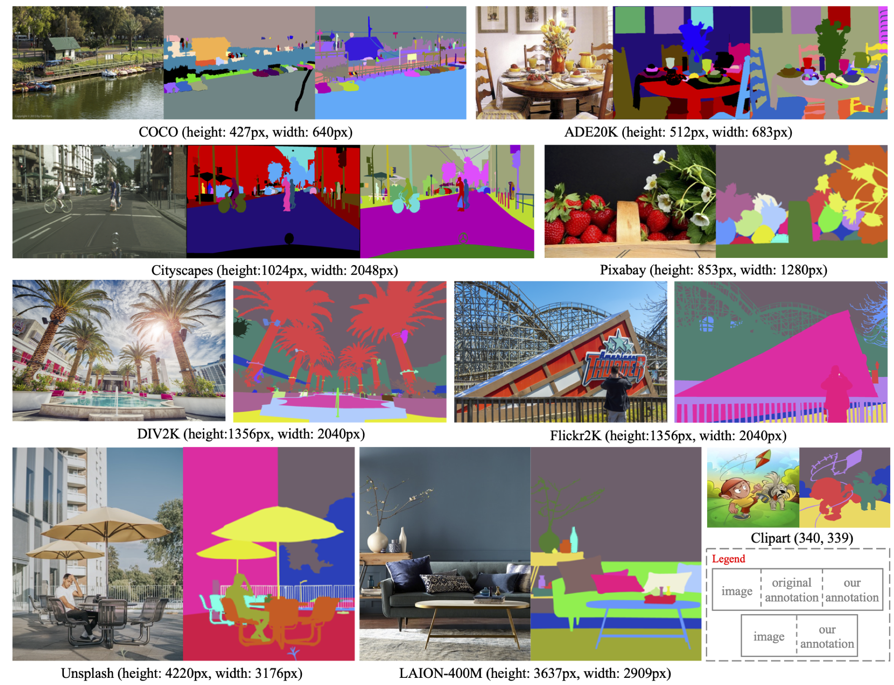

# High Quality Entity Segmentation (ICCV 2023 Oral)
Lu Qi, Jason Kuen, Tiancheng Shen, Jiuxiang Gu, Weidong Guo, Jiaya Jia, Zhe Lin, Ming-Hsuan Yang

This project offers an implementation of the paper, "[High-Quality Entity Segmentation](https://arxiv.org/abs/2211.05776)". This repository serves as an unofficial extension to the [Adobe EntitySeg Github](https://github.com/adobe-research/EntitySeg-Dataset), where you can directly download the  EntitySeg Dataset and the source code for our proposed CropFormer. For a more comprehensive view of our results and visualizations, we invite you to explore our [project website](http://luqi.info/entityv2.github.io/).

<div align="center">
  
</div><br/>

## Data
Please refer to the official repo [EntitySeg-Dataset](https://github.com/adobe-research/EntitySeg-Dataset) for annotation files and image URLs.
For convenience, we provide the images in several links including [Google Drive](), [Hugging Face]() and [Baidu Drive]() but we do not own the copyright of the images. It is solely your responsibility to check the original licenses of the images before using them. Any use of the images are at your own discretion and risk.
Furthermore, please refer to [the dataset description](DATA.md) on how to set up the dataset before running our code.

## Code
We offer the instructions on installation, train, evaluation and visualization for the proposed CropFormer in [the code description](CODE.md).

## Model Zoo
Overall, we also provide the pretrained segmentation models in three links including [Google Drive](), [Hugging Face]() and [Baidu Drive](). We illustrate them in the following.

### Entity Segmentation
We provide several entity segmentation models. For all the training, we use the COCO-Entity pretrained models as our initialization that are provided in Google Drive. We evaluate the model on both the overlapped-free $AP$ and no-overlapped $AP^e$ in low-resolution (L) and high-resolution images (H). 
<table><tbody>
<!-- START TABLE -->
<!-- TABLE HEADER -->
<th valign="center">Method</th>
<th valign="center">Backbone</th>
<th valign="center">Sched</th>
<th valign="center">AP_L</th>
<th valign="center">AP_L^e</th>
<th valign="center">AP_H</th>
<th valign="center">AP_H^e</th>
<th valign="center">download</th>

<tr><td align="center">Mask2Former</td>
<td align="center">Swin-T</td>
<td align="center">3x</td>
<td align="center"> - </td>
<td align="center"> 38.8 </td>
<td align="center"> - </td>
<td align="center"> 40.7 </td>
<td align="center"> <a href="">model</a> </td>


<tr><td align="center">CropFormer</td>
<td align="center">Swin-T</td>
<td align="center">3x</td>
<td align="center"> - </td>
<td align="center"> 40.6 </td>
<td align="center"> - </td>
<td align="center"> 43.0 </td>
<td align="center"> <a href="">model</a> </td>

<tr><td align="center">Mask2Former</td>
<td align="center"> Swin-L </td>
<td align="center"> 3x </td>
<td align="center"> - </td>
<td align="center"> 44.4 </td>
<td align="center"> - </td>
<td align="center"> 46.2 </td>
<td align="center"> <a href="">model</a> </td>

<tr><td align="center">CropFormer</td>
<td align="center">Swin-L</td>
<td align="center">3x</td>
<td align="center"> - </td>
<td align="center"> 45.8 </td>
<td align="center"> - </td>
<td align="center"> 48.2 </td>
<td align="center"> <a href="">model</a></td>

<tr><td align="center">Mask2Former</td>
<td align="center"> Hornet-L </td>
<td align="center"> 3x </td>
<td align="center"> 51.0 </td>
<td align="center"> 47.1 </td>
<td align="center"> 53.6 </td>
<td align="center"> 49.2 </td>
<td align="center"> <a href="">model</a> </td>

<tr><td align="center">CropFormer</td>
<td align="center"> Hornet-L </td>
<td align="center"> 3x </td>
<td align="center"> - </td>
<td align="center"> 49.1 </td>
<td align="center"> - </td>
<td align="center"> 51.5 </td>
<td align="center"> <a href="">model</a> </td>
</tbody></table>

### Instance Segmentation
<table><tbody>
<!-- START TABLE -->
<!-- TABLE HEADER -->
<th valign="center">Method</th>
<th valign="center">Backbone</th>
<th valign="center">Sched</th>
<th valign="center">AP_H</th>
<th valign="center">download</th>

<tr><td align="center">Mask2Former</td>
<td align="center">Swin-T</td>
<td align="center">3x</td>
<td align="center"> 22.7 </td>
<td align="center"> <a href="">model</a> </td>


<tr><td align="center">Mask2Former</td>
<td align="center">Swin-L</td>
<td align="center">3x</td>
<td align="center">30.3</td>
<td align="center"> <a href="">model</a> </td>
</tbody></table>

### Semantic Segmentation
<table><tbody>
<!-- START TABLE -->
<!-- TABLE HEADER -->
<th valign="center">Method</th>
<th valign="center">Backbone</th>
<th valign="center">Sched</th>
<th valign="center">mIoU_H</th>
<th valign="center">download</th>

<tr><td align="center">Mask2Former</td>
<td align="center">Swin-T</td>
<td align="center">3x</td>
<td align="center"> 45.2 </td>
<td align="center"> <a href="">model</a> </td>


<tr><td align="center">Mask2Former</td>
<td align="center">Swin-L</td>
<td align="center">3x</td>
<td align="center">51.1</td>
<td align="center"> <a href="">model</a> </td>
</tbody></table>

### Panoptic Segmentation
<table><tbody>
<!-- START TABLE -->
<!-- TABLE HEADER -->
<th valign="center">Method</th>
<th valign="center">Backbone</th>
<th valign="center">Sched</th>
<th valign="center">PQ_H</th>
<th valign="center">download</th>

<tr><td align="center">Mask2Former</td>
<td align="center">Swin-T</td>
<td align="center">3x</td>
<td align="center"> 9.8 </td>
<td align="center"> <a href="">model</a> </td>


<tr><td align="center">Mask2Former</td>
<td align="center">Swin-L</td>
<td align="center">3x</td>
<td align="center">13.5</td>
<td align="center"> <a href="">model</a> </td>
</tbody></table>

## <a name="Citation"></a>Citing Ours

Consider to cite **High Quality Entity Segmentation** if it helps your research.

```
@inproceedings{qi2022high,
  title={High Quality Entity Segmentation},
  author={Qi, Lu and Kuen, Jason and Shen, Tiancheng and Gu, Jiuxiang and Guo, Weidong and Jia, Jiaya and Lin, Zhe and Yang, Ming-Hsuan},
  booktitle={ICCV},
  year={2023}
}
```
## <a name="License"></a>License
CC BY-NC 4.0
