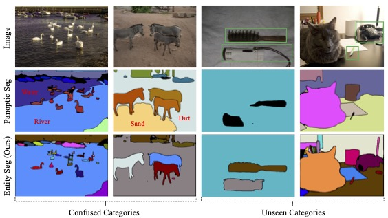
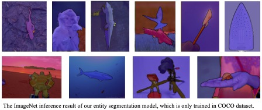

# Enity World Entity Segmentation
Lu Qi*, Jason Kuen*, Yi Wang, Jiuxiang Gu, Hengshuang Zhao, Zhe Lin, Philip Torr, Jiaya Jia

<div align="center">
  
</div><br/>

This project provides an implementation for the paper "[Open World Entity Segmentation](https://jiaya.me/papers/ms_align_distill_cvpr21.pdf)" based on [Detectron2](https://github.com/facebookresearch/detectron2). Entity segmentation targets to segment everything without considering the specific category. Thus our entity segmentation models could perform well on crossed dataset like using COCO as training dataset but inference in others. Please refer to our supplementary file for more visualizations.

<div align="center">
  
</div><br/>


## Installation
This project is based on [Detectron2](https://github.com/facebookresearch/detectron2), which can be constructed as follows.
* Install Detectron2 following [the instructions](https://detectron2.readthedocs.io/tutorials/install.html). We are noting that our code is implemented in detectron2 commit version 28174e932c534f841195f02184dc67b941c65a67 and pytorch 1.8.
* Setup the coco dataset including instance and panoptic annotations following [the structure](https://github.com/facebookresearch/detectron2/blob/master/datasets/README.md).
* Copy this project to `/path/to/detectron2/projects/EntitySeg`
* Set the "find_unused_parameters=True" in distributed training of your own detectron2. You could modify it in detectron2/engine/defaults.py.

## Data pre-processing
(1) Generate the entity information of each image by the instance and panoptic annotation. Please change the path of coco annotation files in the following code.
```bash
cd /path/to/detectron2/projects/EntitySeg/make_data
bash make_entity_mask.sh
```
(2) Change the generated entity information to the json files.
```bash
cd /path/to/detectron2/projects/EntitySeg/make_data
python3 entity_to_json.py
```


## Training
To train model with 8 GPUs, run:
```bash
cd /path/to/detectron2
python3 projects/EntitySeg/train_net.py --config-file <projects/EntitySeg/configs/config.yaml> --num-gpus 8
```

For example, to launch entity segmentation training (1x schedule) with ResNet-50 backbone on 8 GPUs and save the model in the path "/data/entity_model".
one should execute:
```bash
cd /path/to/detectron2
python3 projects/EntitySeg/train_net.py --config-file projects/EntitySeg/configs/entity_default.yaml --num-gpus 8 OUTPUT_DIR /data/entity_model
```

## Evaluation
To evaluate a pre-trained model with 8 GPUs, run:
```bash
cd /path/to/detectron2
python3 projects/EntitySeg/train_net.py --config-file <config.yaml> --num-gpus 8 --eval-only MODEL.WEIGHTS model_checkpoint
```

## Visualization
To visualize some image result of a pre-trained model, run:
```bash
cd /path/to/detectron2
python3 projects/EntitySeg/demo_result_and_vis.py --config-file <config.yaml> --input <input_path> --output <output_path> MODEL.WEIGHTS model_checkpoint MODEL.CONDINST.MASK_BRANCH.USE_MASK_RESCORE "True"
```
For example,
```bash
python3 projects/EntitySeg/demo_result_and_vis.py --config-file projects/EntitySeg/configs/entity_swin_lw7_1x.yaml --input /data/input/*.jpg --output /data/output MODEL.WEIGHTS /data/pretrained_model/R_50.pth MODEL.CONDINST.MASK_BRANCH.USE_MASK_RESCORE "True"
```
## Pretrained Swin Weight
Use the tools/convert_swin_to_d2.py to convert the pretrained swin weight to the detectron2 weight. For example,
```bash
pip install timm
wget https://github.com/SwinTransformer/storage/releases/download/v1.0.0/swin_tiny_patch4_window7_224.pth
python tools/convert_swin_to_d2.py swin_tiny_patch4_window7_224.pth swin_tiny_patch4_window7_224_trans.pth
```

## Results
We provide the results on COCO *val* set with several pretrained models. It is easy to extend it to other backbones. Rescore means we use mask rescoring by setting MODEL.CONDINST.MASK_BRANCH.USE_MASK_RESCORE True.

<table><tbody>
<!-- START TABLE -->
<!-- TABLE HEADER -->
<th valign="bottom">Method</th>
<th valign="bottom">Backbone</th>
<th valign="bottom">Sched</th>
<th valign="bottom">Rescore</th>
<th valign="bottom">Entity</th>
<th valign="bottom">download</th>

<tr><td align="center">Baseline</td>
<td align="center">R50</td>
<td align="center">1x</td>
<td align="center">No</td>
<td align="center"> 28.3 </td>
<td align="center"> <a href="https://drive.google.com/file/d/17MsgUfjVSOs4_R8FO6mzMwtg0vH4HC57/view?usp=sharing">model</a>&nbsp;|&nbsp;<a href="https://drive.google.com/file/d/1UQ50Fj8e-5-LHiFEfKuOgz5SrQ7ocahD/view?usp=sharing">metrics</a> </td>
<!-- <td align="center"> To be released </td> -->

<tr><td align="center">Ours</td>
<td align="center">R50</td>
<td align="center">1x</td>
<td align="center">No</td>
<td align="center"> 29.8 </td>
<td align="center"> <a href="https://drive.google.com/file/d/1_p_gP5_NTTqVlSXJFqdh3h8rW2KwoV5Q/view?usp=sharing">model</a>&nbsp;|&nbsp;<a href="https://drive.google.com/file/d/1E1jKu29u9dwLBRA7GFDmquQUhz8ZNU8A/view?usp=sharing">metrics</a> </td>

<tr><td align="center">Ours</td>
<td align="center">R50</td>
<td align="center">3x</td>
<td align="center">No</td>
<td align="center"> 31.8 </td>
<td align="center"> <a href="https://drive.google.com/file/d/1AygMH7vq3ufBwalqgycuKvagjWcWue70/view?usp=sharing">model</a>&nbsp;|&nbsp;<a href="https://drive.google.com/file/d/1FStVA04AUk-cs2kC07vVfG1YSyZEHlxG/view?usp=sharing">metrics</a> </td>
<!-- <td align="center"> To be released </td> -->
</tr>
<tr><td align="center">Ours</td>
<td align="center">R101</td>
<td align="center">1x</td>
<td align="center">No</td>
<td align="center"> 31.0 </td>
<td align="center"> <a href="https://drive.google.com/file/d/13oxyTQvYKKim1SEdlS-a9ME-yVTaQhmG/view?usp=sharing">model</a>&nbsp;|&nbsp;<a href="https://drive.google.com/file/d/17nuCXu9cqoJfqOsW-xFkTeDXbYYSNIzA/view?usp=sharing">metrics</a> </td>

<tr><td align="center">Ours</td>
<td align="center">R101</td>
<td align="center">3x</td>
<td align="center">No</td>
<td align="center">  </td>
<td align="center"> <a href="">model</a>&nbsp;|&nbsp;<a href="">metrics</a> </td>

<tr><td align="center">Ours</td>
<td align="center">R101-DCNv2</td>
<td align="center">3x</td>
<td align="center">No</td>
<td align="center"> 35.5 </td>
<td align="center"> <a href="https://drive.google.com/file/d/1bpjZk8svC-WPvsexInXfwgIdj7rLg2gM/view?usp=sharing">model</a>&nbsp;|&nbsp;<a href="https://drive.google.com/file/d/1PcYLxtqHTvEsU7bx4T9Hxx-HcJ_72pnF/view?usp=sharing">metrics</a> </td>

<tr><td align="center">Ours</td>
<td align="center">Swin-T</td>
<td align="center">1x</td>
<td align="center">No</td>
<td align="center"> 33.0 </td>
<td align="center"> <a href="https://drive.google.com/file/d/1uMxGjCx7pA_GocdVA-3rmvcAZQw2nvIC/view?usp=sharing">model</a>&nbsp;|&nbsp;<a href="https://drive.google.com/file/d/1zSqPrm9qs8pP02_bClpEnCj_dfERzkVW/view?usp=sharing">metrics</a> </td>

<tr><td align="center">Ours</td>
<td align="center">Swin-L-W7</td>
<td align="center">1x</td>
<td align="center">No</td>
<td align="center"> 37.8 </td>
<td align="center"> <a href="https://drive.google.com/file/d/1uAJgkFsBr_f3wGzNby_mKZA2JkkQARHh/view?usp=sharing">model</a>&nbsp;|&nbsp;<a href="https://drive.google.com/file/d/1nThaanHv_O21LQGaEGQuiPQab_k5NyTS/view?usp=sharing">metrics</a> </td>

<tr><td align="center">Ours</td>
<td align="center">Swin-L-W7</td>
<td align="center">1x</td>
<td align="center">Yes</td>
<td align="center"> 39.3 </td>
<td align="center"> <a href="https://drive.google.com/file/d/1uAJgkFsBr_f3wGzNby_mKZA2JkkQARHh/view?usp=sharing">model</a>&nbsp;|&nbsp;<a href="https://drive.google.com/file/d/1nThaanHv_O21LQGaEGQuiPQab_k5NyTS/view?usp=sharing">metrics</a> </td>


<tr><td align="center">Ours</td>
<td align="center">Swin-L-W7</td>
<td align="center">3x</td>
<td align="center">No</td>
<td align="center">  </td>
<td align="center"> <a href="">model</a>&nbsp;|&nbsp;<a href="">metrics</a> </td>

<tr><td align="center">Ours</td>
<td align="center">Swin-L-W12</td>
<td align="center">3x</td>
<td align="center">No</td>
<td align="center">  </td>
<td align="center"> <a href="">model</a>&nbsp;|&nbsp;<a href="">metrics</a> </td>

</tbody></table>

## <a name="Citing Ours"></a>Citing Ours

Consider cite open world entity segmentation in your publications if it helps your research.

```
@inprocedings{qi2021open,
  title={Open World Entity Segmentation},
  author={Lu Qi, Jason Kuen, Yi Wang, Jiuxiang Gu, Hengshuang Zhao, Zhe Lin, Philip Torr, Jiaya Jia},
  booktitle={arxiv},
  year={2021}
}